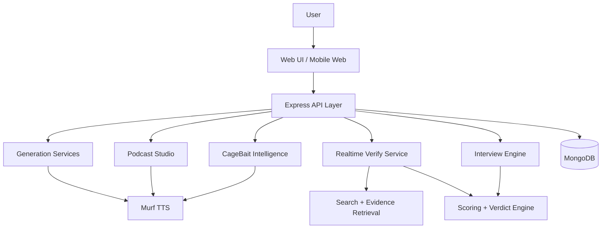
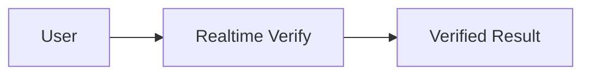
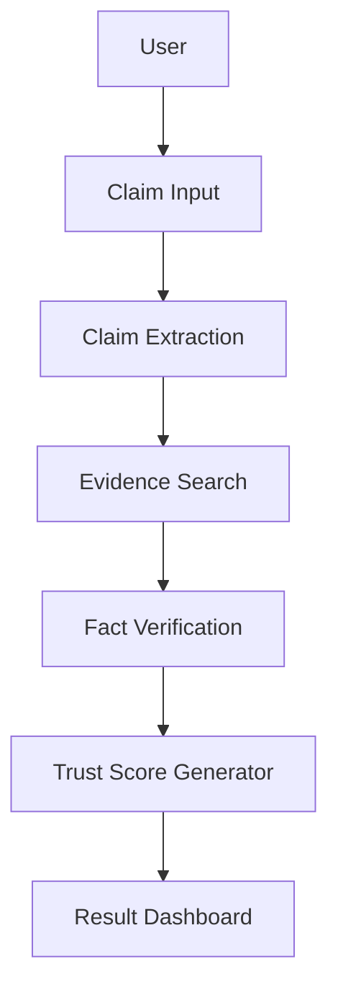
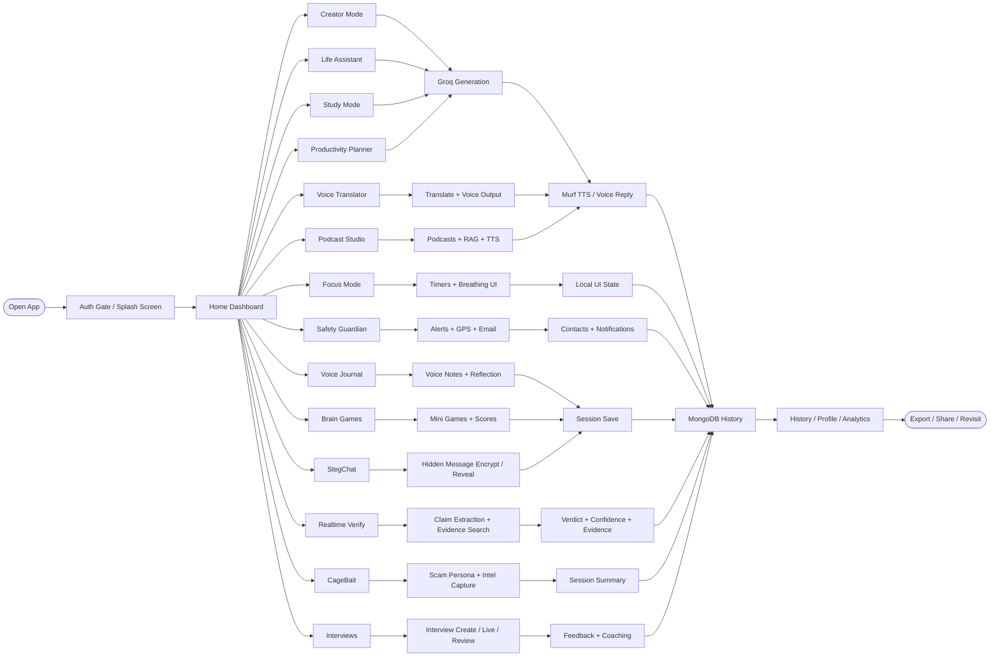
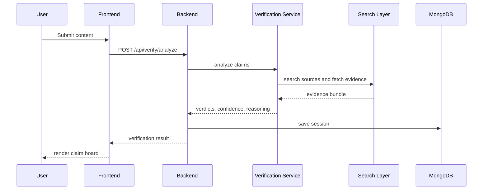
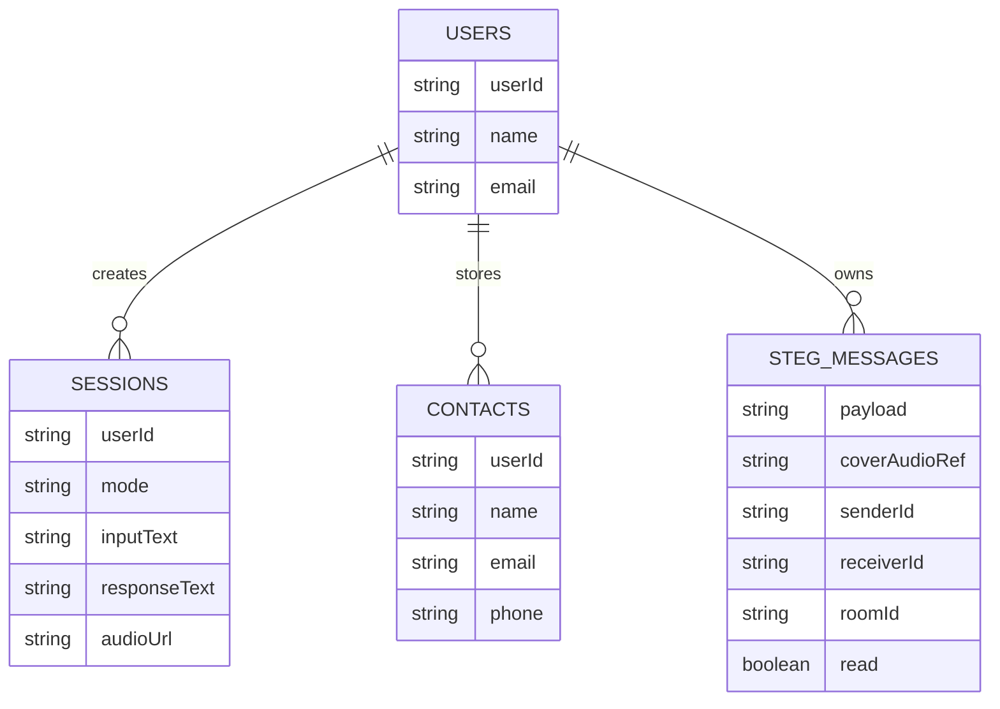
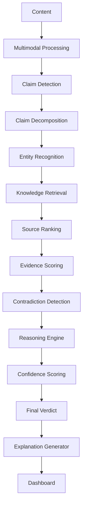
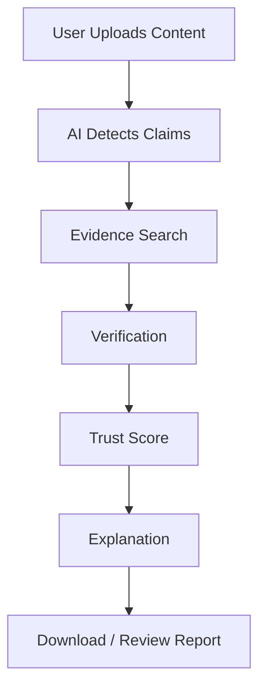
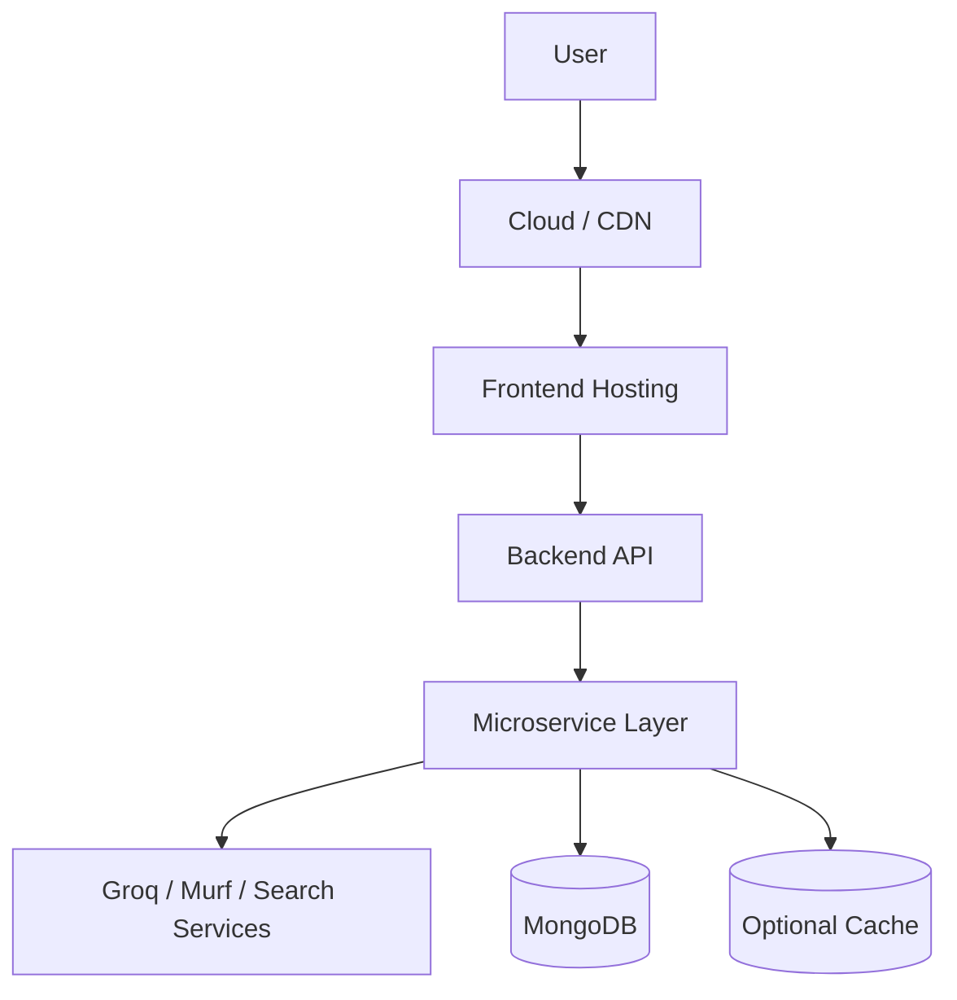
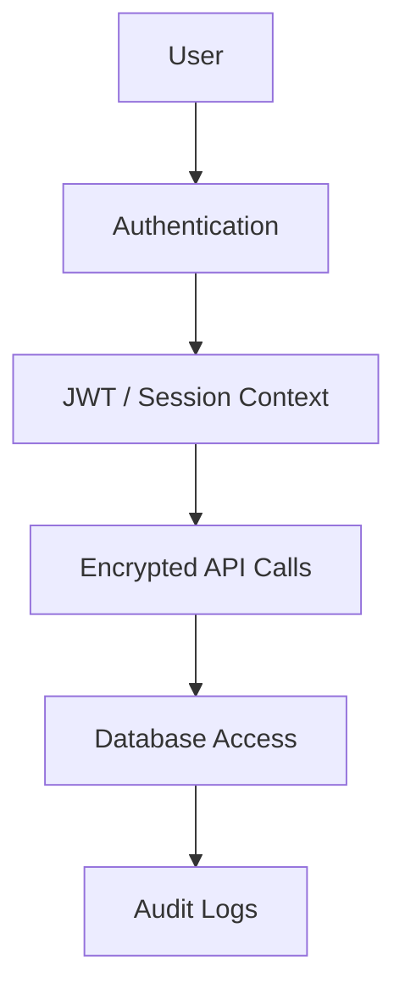

# Vortex Voice AI

## Realtime Verify Whitepaper

### Autonomous Multi-Agent Claim Intelligence and Live Verification Platform

Project: Vortex Voice AI

Feature Focus: Realtime Verify

Team: Buildathon / Susant Edit

Hackathon: Murf AI Hackathon

Date: June 1, 2026

---

## 1. Cover Page

Realtime Verify is the autonomous verification layer inside Vortex Voice AI. It extracts factual claims from text, audio, images, articles, podcasts, interviews, and live conversations, then searches trusted sources, scores evidence, and returns transparent verdicts with confidence and reasoning.

### Tagline

Transform unverified content into evidence-backed truth in real time.

---

## 2. Executive Summary

### Problem

Misinformation spreads faster than manual fact-checking can keep up. Users often cannot tell what is true, partially true, misleading, or unverified, especially when content comes from fast-moving social, audio, or video sources.

### Solution

Realtime Verify automatically detects claims, decomposes compound statements, retrieves evidence from trusted sources, analyzes contradictions, scores source credibility, and generates clear verdicts with supporting evidence.

### Key Features

- Autonomous claim extraction
- Multi-source evidence retrieval
- Source credibility scoring
- Contradiction detection
- Temporal reasoning
- Multimodal verification support
- Explainable verdict generation
- Confidence and trust scoring

### Impact

The platform helps journalists, students, researchers, and the general public verify information faster and with more transparency.

---

## 3. Problem Statement

### Current Issues

- Misinformation spreads rapidly across social platforms and messaging apps.
- Manual fact-checking is slow and does not scale to live streams.
- Users struggle to verify claims from audio, screenshots, or short posts.
- Traditional fact-checkers often provide results too late to influence decisions.

### Why It Matters

Realtime verification is useful when the content is time-sensitive, politically charged, AI-generated, or likely manipulated.

### Problem Landscape


---

## 4. Proposed Solution

### Overview

```text
Content Input
   ↓
Claim Extraction
   ↓
Claim Decomposition
   ↓
Evidence Retrieval
   ↓
Source Credibility Analysis
   ↓
Contradiction Detection
   ↓
Temporal & Contextual Reasoning
   ↓
Confidence Scoring
   ↓
Final Verdict Generation
   ↓
User Dashboard
```

### What Makes It Different

- Works on text, URLs, OCR text, and image descriptions.
- Produces per-claim verdicts rather than only a single global answer.
- Gives evidence summaries, reasoning, and credibility signals.
- Supports voice output for accessibility and rapid review.

---

## 5. System Architecture

### High-Level Architecture



### Architecture Notes

- Frontend: React + Vite
- Backend: Node.js + Express
- Database: MongoDB + Mongoose
- AI: Groq-backed reasoning and content generation
- TTS: Murf Falcon
- Auth: Firebase Auth

---

## 6. Data Flow Diagram (DFD)

### Level 0



### Level 1



---

## 7. Whole Codebase Flowchart



### Flow Notes

- Every mode starts from the same app shell and dashboard.
- Groq powers generation, reasoning, and several assistant-style responses.
- Murf handles voice output where audio playback is needed.
- MongoDB stores sessions, history, and feature-specific results.
- The UI can branch into voice, safety, productivity, media, verification, and interview workflows without leaving the app.

---

## 8. Technology Stack

| Layer | Technology |
|---|---|
| Frontend | React, Vite, Framer Motion, Tailwind CSS |
| Backend | Node.js, Express |
| Database | MongoDB, Mongoose |
| AI / Reasoning | Groq API |
| Search / Retrieval | DuckDuckGo + page summaries |
| Authentication | Firebase Auth |
| Email | EmailJS, Resend, Gmail fallback |
| TTS | Murf Falcon API |
| Hosting | Netlify / Vercel frontend, Render backend |

---

## 9. Features

### Core Verification Features

- Autonomous claim extraction
- Claim decomposition into smaller verifiable units
- Evidence retrieval from trusted sources
- Source credibility analysis
- Contradiction detection
- Confidence score generation
- Explainable verdicts
- Re-verification on refresh

### Platform Features

- Live voice summaries
- Session history
- Mobile responsive UI
- Onboarding tour
- PWA install support
- Copy/download/share actions
- Theme-aware animated interface

---

## 10. Sequence Diagram



---

## 11. Database Design (ER Diagram)



### Data Entities

- Users: authentication and ownership context
- Sessions: generated outputs and verification history
- Contacts: emergency contact records
- StegMessages: hidden-message payloads for StegChat

---

## 12. AI Pipeline

This is the most important section for a hackathon judge.



### Current Verification Behavior

1. Normalizes the incoming input.
2. Extracts claims using Groq or heuristic fallback extraction.
3. Builds a search query from each claim.
4. Searches DuckDuckGo and optionally a provided source URL.
5. Fetches and trims source pages.
6. Scores support, contradiction, freshness, and reliability.
7. Generates per-claim verdicts and confidence values.
8. Creates reasoning text and evidence cards.
9. Returns summary metrics for the UI.

---

## 13. User Journey Flow



---

## 14. Deployment Architecture



### Practical Deployment for This Repo

- Frontend: Netlify or Vercel
- Backend: Render
- Database: MongoDB Atlas
- CDN: Hosting platform edge network

---

## 15. Security Architecture



### Security Controls

- Firebase authentication
- CORS controls in the backend
- Rate limiting in sensitive flows
- Encrypted external API calls where supported
- App-level consent for TTS verification output

---

## 16. Analytics Dashboard

The app can display verification metrics such as:

- Claims verified
- Accuracy rate
- Average verification time
- Most checked topics
- Source reliability distribution
- Confidence score distribution

### Example Metric Block

```text
Claims Verified           24
Accuracy Rate             96.8%
Average Verification Time  3.2s
Source Reliability        High
```

---


### Suggested Caption Style

- Figure 1. Landing page with hero section and feature cards
- Figure 2. Realtime Verify dashboard with claim board and evidence cards
- Figure 3. Verification result showing verdict, confidence, and source credibility

---

## 18. Impact Analysis

### Benefits

- Reduces misinformation exposure
- Speeds up fact-checking
- Increases trust in content
- Supports journalism and research
- Helps users make better decisions faster

### Target Users

- Journalists
- Students
- Researchers
- Government agencies
- General public

### SDG Alignment

- Quality Education
- Peace, Justice and Strong Institutions
- Industry, Innovation and Infrastructure

---

## 19. Innovation Matrix

| Feature | Existing Fact Checkers | Realtime Verify |
|---|---:|---:|
| Real-time verification | Limited | Yes |
| Autonomous claim extraction | No | Yes |
| Explainable reasoning | Partial | Yes |
| Confidence scoring | Limited | Yes |
| Multimodal input | Limited | Yes |
| Voice summary | Rare | Yes |

---

## 20. Future Scope

### Short-Term

- Browser extension
- Mobile app
- More dashboard analytics
- Better report export

### Mid-Term

- Deepfake detection
- Stronger multimodal verification
- Social media integration
- More advanced AI agent coordination

### Long-Term

- Global fact graph
- Government and newsroom integration
- Continuous misinformation monitoring
- Cross-platform verification intelligence

---

## 21. Repository Pages

### Client Routes

- `/` and `/vortex` - Home dashboard
- `/creator` - Creator Mode
- `/assistant` - Life Assistant
- `/study` - Study Mode
- `/focus` - Focus Mode
- `/planner` - Productivity Planner
- `/safety` - Safety Guardian
- `/translator` - Voice Translator
- `/history` - Session History
- `/profile` - Profile and stats
- `/podcast` - Podcast Studio
- `/journal` - Voice Journal
- `/games` - Brain Games
- `/cagebait` - CageBait
- `/verification` - Realtime Verify
- `/interviews` - Interviews hub
- `/interviews/new` - Interview builder
- `/interviews/live/:sessionId` - Interview room
- `/interviews/review/:sessionId` - Interview review

### Backend Route Groups

- `/api/generate-*` - generation and TTS features
- `/api/history` - session history
- `/api/contacts` - emergency contacts
- `/api/podcast/*` - podcast workflows
- `/api/interviews/*` - interview workflows
- `/api/cagebait/*` - scam honeypot flows
- `/api/verify/*` - Realtime Verify flows
- `/api/steg/*` - hidden audio message workflows

---

## 22. Appendix

### Useful References

- API endpoints
- model architecture notes
- prompt design patterns
- dataset and source assumptions
- evaluation metrics
- deployment notes

### Key Code Paths

- `client/src/App.jsx` - route map and auth gate
- `client/src/services/api.js` - frontend API wrapper
- `client/src/pages/Verification.jsx` - Realtime Verify UI
- `server/app.js` - backend startup and route mounting
- `server/services/verificationService.js` - claim extraction and verdict generation
- `server/controllers/verificationController.js` - verification API handlers
- `server/services/groqService.js` - Groq-backed generation helpers
- `server/services/murfService.js` - text-to-speech integration

---

## 23. Conclusion

Realtime Verify turns unverified content into evidence-backed intelligence by combining claim extraction, retrieval, credibility scoring, contradiction detection, and transparent verdict generation.

It is designed to be judge-ready for hackathons and practical enough to evolve into a real-world verification engine.

---

## 24. After Deploy Checklist

Use this section to verify the app after publishing a new build.

### Frontend Checks

- Confirm the deployed frontend loads the latest build.
- Check that the route changes work for all main pages.
- Verify the verification page renders the claim board and evidence cards.
- Test login, splash screen, and onboarding flow.
- Confirm the social share / copy / PWA install prompts still work.

### Backend Checks

- Confirm `GET /api/ping` responds successfully.
- Verify `POST /api/verify/analyze` returns claims and verdicts.
- Verify `POST /api/verify/analyze-tts` returns audio when consent is enabled.
- Confirm `POST /api/transcribe` uses `STT_PROVIDER=GROQ` and your Groq key.
- Check that `/api/history`, `/api/podcast/*`, `/api/interviews/*`, `/api/cagebait/*`, and `/api/steg/*` still respond.

### Environment Checks

- `MONGODB_URI` points to the production database.
- `GROQ_API_KEY` is set in the deployed environment.
- `MURF_API_KEY` is set for voice output.
- `VITE_API_URL` points to the live backend URL.
- `STT_PROVIDER` is set to `GROQ` if server transcription is needed.

### Content Checks

- Update screenshots in the UI screenshots section.
- Replace any placeholder text with final hackathon wording.
- Confirm README links point to the live deployment URLs.
- Verify the documentation screenshots and diagrams match the final UI.
# Vortex Voice AI Documentation

## Overview

Vortex Voice AI is a voice-first AI platform for generation, tutoring, productivity, safety, podcasting, interviews, translation, and realtime claim verification. It combines React, Vite, Framer Motion, Tailwind CSS, Firebase Auth, Node.js, Express, MongoDB, Groq, Murf, Google Translate, EmailJS, and several free public APIs.

The app is split into a client in `client/` and a server in `server/`.

## Product Modules

### 1. Creator Mode

Generates scripts for short-form content, reels, podcasts, and other spoken media. The backend creates a text response and converts it to speech through Murf.

### 2. Life Assistant

Provides calm, structured advice from user prompts. It can also generate voice output.

### 3. Study Mode

Explains concepts, simplifies topics, and supports revision-style responses with voice narration.

### 4. Focus Mode

Includes a Pomodoro-style productivity flow, guided breathing, and completion overlays.

### 5. Productivity Planner

Turns a goal into a practical daily plan.

### 6. Safety Guardian

Emergency-oriented workflow with SOS activation, live GPS updates, weather at the emergency location, contact alerts, all-clear messages, fake dispatcher flows, and voice-triggered SOS.

### 7. Voice Translator

Translates text to a target language and can speak the translated result.

### 8. Podcast Studio

Generates multi-voice podcasts from text or URLs and supports transcript chat.

### 9. Voice Journal

Lets users speak or type daily entries and receive reflective responses.

### 10. Brain Games

Interactive play area with trivia, debate, riddles, mood check-ins, pronunciation coaching, music, image description, news-style summaries, jokes, and Pokémon trivia.

### 11. History

Stores session history for generated content and analysis results.

### 12. CageBait

A scam-honeypot style conversation simulator with persona-based responses, intel extraction, and session summaries.

### 13. Realtime Verify

Autonomous claim intelligence and live verification for text, URLs, OCR output, and uploaded content. This is the app’s fact-checking layer.

## Feature Matrix

| Module | What It Does |
|------|-------------|
| Creator Mode | Generates spoken scripts and voice output for content creation |
| Life Assistant | Gives structured advice with optional voice narration |
| Study Mode | Explains, revises, and quizzes educational topics |
| Focus Mode | Runs focus sessions, breathing, and progress overlays |
| Productivity Planner | Turns goals into practical plans |
| Safety Guardian | Handles SOS activation, alerts, live GPS, and weather context |
| Voice Translator | Translates and speaks text in many languages |
| Podcast Studio | Builds two-speaker podcasts and supports transcript chat |
| Voice Journal | Records reflective daily entries |
| Brain Games | Provides trivia, debate, puzzle, and audio/image mini experiences |
| History | Stores previous sessions and outputs |
| CageBait | Simulates scam interactions and extracts intelligence |
| Interviews | Builds, runs, and reviews mock interview sessions |
| Realtime Verify | Extracts claims and verifies them against evidence in real time |
| StegChat | Hides and reveals audio messages with encryption and LSB embedding |

## Realtime Verify

Realtime Verify automatically detects factual claims, decomposes compound claims, searches sources, evaluates evidence, scores confidence, detects contradictions, and returns transparent verdicts.

### Verification Pipeline

1. Content input is received.
2. Claims are detected and extracted.
3. Compound claims are broken into atomic units.
4. Evidence is retrieved from trusted sources.
5. Source credibility is scored.
6. Evidence is compared for support and contradiction.
7. Temporal context is considered where possible.
8. A verdict and confidence score are produced.
9. Claims and evidence are shown in the claim board.

### Verdict Labels

The system uses readable verdict labels rather than a binary true/false-only output.

- True
- Mostly true
- Partly true
- Misleading
- False
- Unverified

### Current Implementation Notes

The implementation currently supports:

- Claim extraction from text, URLs, OCR text, and image descriptions
- Search-based evidence gathering using web and source summaries
- Source reliability scoring
- Contradiction scoring
- Freshness scoring
- Manipulation-risk scoring
- Per-claim reasoning text
- Voice playback of verification summaries

The implementation does not yet include a true distributed multi-agent runtime, live social-stream ingestion, full knowledge-graph persistence, or deep multimodal video/audio analysis beyond the current input handlers.

### Verification Endpoints

- `POST /api/verify/analyze`
  - Body: `inputText`, `sourceUrl`, `imageText`, `inputType`
  - Returns: full verification bundle with claims, summary, evidence, and reasoning

- `POST /api/verify/refresh`
  - Body: same as analyze
  - Re-runs verification on the current inputs

- `POST /api/verify/analyze-tts`
  - Body: same as analyze plus `ttsVoice` and `consent`
  - Returns verification plus audio data URI when TTS succeeds

## Client Pages

### Public Flow

The app starts with a splash screen, then gates access through Firebase authentication. Once signed in, the main navbar and route set become available.

### Routes

- `/` and `/vortex` - Home dashboard
- `/creator` - Script and voice generation
- `/assistant` - Life assistant
- `/study` - Study and revision tools
- `/focus` - Focus and breathing tools
- `/planner` - Goal planning
- `/safety` - Safety Guardian
- `/translator` - Translation workflow
- `/history` - User session history
- `/profile` - User profile and stats
- `/podcast` - Podcast Studio
- `/journal` - Voice journal
- `/games` - Brain games
- `/cagebait` - CageBait scam-honeypot simulator
- `/verification` - Realtime Verify console
- `/interviews` - Interview hub
- `/interviews/new` - Interview builder
- `/interviews/live/:sessionId` - Live interview room
- `/interviews/review/:sessionId` - Interview review screen

### Page Inventory

- `HomeNew` - Main landing dashboard with section navigation and live quote bar
- `Creator` - Script and narration generator
- `Assistant` - Advice and conversational assistance
- `Study` - Study/revision workflows and quiz-style interactions
- `Focus` - Pomodoro and breathing workflow
- `Planner` - Goal-to-plan generator
- `Safety` - Emergency control center with SOS and contact tools
- `Translator` - Translation and read-aloud workflow
- `History` - Saved session browser
- `Profile` - User stats and account context
- `Podcast` - Podcast generation and transcript chat
- `Journal` - Voice journal and reflections
- `Games` - Brain games hub
- `CageBait` - Scam honeypot simulator
- `Verification` - Realtime Verify console with claim board and evidence cards
- `Interviews` - Interview hub and session list
- `InterviewBuilder` - Interview plan creation
- `InterviewRoom` - Live interview session with coaching and unverified mode
- `InterviewReview` - Final interview review and feedback summary

## Backend Architecture

The Express server is defined in `server/app.js`.

### Server Responsibilities

- Load environment variables with `dotenv`
- Enable permissive CORS for hackathon deployment targets
- Parse JSON payloads
- Mount all API route groups under `/api`
- Connect to MongoDB with Mongoose
- Start the HTTP and Socket.IO servers
- Expose a ping endpoint for warm-up and health checks

### Route Groups

- `/api/generate-*` - Script, advice, topic explanation, planning, TTS, translation, alerts, contact, image description
- `/api/history` - Session history retrieval and deletion
- `/api/interviews/*` - Interview planning, continuation, and feedback
- `/api/podcast/*` - Podcast generation and transcript chat
- `/api/cagebait/*` - Persona conversation and intel extraction
- `/api/verify/*` - Realtime Verify analysis, refresh, and TTS
- `/api/steg/*` - StegChat send and reveal flows

### Runtime Notes

- The client uses Firebase Auth as the gate before the main app renders.
- The client starts with a splash screen and then loads the full route set after authentication resolves.
- The server warms itself on startup through `GET /api/ping` and keeps a permissive CORS policy for deployment targets.
- Session history is written from multiple feature flows, so a single user can revisit outputs across creator, assistant, study, planner, podcast, cagebait, interviews, verification, and other generation screens.

## API Reference

### Generation

- `POST /api/generate-script`
  - Body: `text`, `tone`, `userId`
  - Returns: generated script text and audio URL

- `POST /api/generate-advice`
  - Body: `text`, `userId`, `cognitiveLabel`
  - Returns: advice text and optional audio URL

- `POST /api/explain-topic`
  - Body: `topic`, `mode`, `userId`

- `POST /api/generate-plan`
  - Body: `goal`, `userId`

- `POST /api/text-to-speech`
  - Body: `text`, `voice`, `mode`

- `POST /api/translate`
  - Body: `text`, `targetLang`

- `POST /api/transcribe`
  - Multipart body with `audio`

- `GET /api/stt/status`
  - Returns configured speech-to-text provider status

### History and Contacts

- `GET /api/history?userId=...`
- `DELETE /api/history/:id`
- `GET /api/contacts/:userId`
- `POST /api/contacts`
- `DELETE /api/contacts/:id`

### Podcast Studio

- `POST /api/podcast/generate`
  - Body: `mode`, `content`, `url`, `style`, `depth`, `language`, `userId`

- `POST /api/podcast/chat`
  - Body: `question`, `transcript`

### Interviews

- `POST /api/interviews/create`
- `POST /api/interviews/next`
- `POST /api/interviews/feedback`

### CageBait

- `GET /api/cagebait/personas`
- `POST /api/cagebait/respond`
- `POST /api/cagebait/extract-intel`
- `POST /api/cagebait/end-session`

### Realtime Verify

- `POST /api/verify/analyze`
- `POST /api/verify/refresh`
- `POST /api/verify/analyze-tts`

### StegChat

- `POST /api/steg/send`
- `POST /api/steg/reveal`

### StegChat Detail

- `POST /api/steg/send`
  - Body: `audio`, `message`, `pin`, `senderId`, `receiverId`, `roomId`, `duration`
  - Encrypts the message, embeds it in a WAV file, stores it, and emits a Socket.IO voice-note event

- `POST /api/steg/reveal`
  - Body: `stegMessageId`, `pin`
  - Decodes, decrypts, streams TTS playback, and burns the hidden message after reveal

## Data Model

### Session

Used to persist generated outputs and product usage across modes. Sessions store:

- `userId`
- `mode`
- `inputText`
- `responseText`
- `audioUrl`

### Other Models

- `Contact` - Saved emergency contacts
- `StegMessage` - Hidden-message payload storage

## Services

### Groq Service

Handles script generation, advice, topic explanations, image description, interview planning, interview continuation, and interview summarization.

### Murf Service

Turns text into audio output. It is used for creator mode, assistant mode, study mode, planner mode, podcast lines, CageBait personas, and verification voice summaries.

### Verification Service

Fetches pages, searches the web, scores support and contradiction, and returns a bundle with claims, evidence, summary, and reasoning.

### Translation Service

Translates text to supported languages.

### Podcast Service

Extracts source text from URLs and generates two-speaker podcast scripts.

### CageBait Service

Creates scammer-facing persona responses, extracts intel, and summarizes sessions.

### Email Service

Sends emergency and contact emails for Safety Guardian.

### Steg Services

Encrypt, hide, decode, and burn hidden audio messages.

## Environment Variables

### Client

- `VITE_API_URL`
- `VITE_FIREBASE_API_KEY`
- `VITE_FIREBASE_AUTH_DOMAIN`
- `VITE_FIREBASE_PROJECT_ID`
- `VITE_FIREBASE_STORAGE_BUCKET`
- `VITE_FIREBASE_MESSAGING_SENDER_ID`
- `VITE_FIREBASE_APP_ID`
- `VITE_EMAILJS_SERVICE_ID`
- `VITE_EMAILJS_TEMPLATE_ID`
- `VITE_EMAILJS_UPDATE_TEMPLATE`
- `VITE_EMAILJS_PUBLIC_KEY`
- `VITE_EMAILJS_SERVICE_ID_2`
- `VITE_EMAILJS_TEMPLATE_ID_2`
- `VITE_EMAILJS_UPDATE_TEMPLATE_2`
- `VITE_EMAILJS_PUBLIC_KEY_2`
- `VITE_EMAILJS_SERVICE_ID_3`
- `VITE_EMAILJS_TEMPLATE_ID_3`
- `VITE_EMAILJS_UPDATE_TEMPLATE_3`
- `VITE_EMAILJS_PUBLIC_KEY_3`

### Server

- `MONGODB_URI`
- `GROQ_API_KEY`
- `GROQ_API_KEY_2`
- `GROQ_API_KEY_3`
- `GROQ_API_KEYS`
- `MURF_API_KEY`
- `MURF_API_URL`
- `RESEND_API_KEY`
- `RESEND_FROM_EMAIL`
- `GMAIL_USER`
- `GMAIL_APP_PASSWORD`
- `STT_PROVIDER=GROQ`
- `GROQ_API_KEY` for STT, generation, and verification
- `FRONTEND_URL`

## Setup

### Local Development

```bash
cd client && npm install
cd ../server && npm install
cd client && npm run dev
cd ../server && node app.js
```

### Deployment

- Frontend: Netlify
- Backend: Render
- Database: MongoDB Atlas or another MongoDB-compatible host

## Verification Flow Details

The current Realtime Verify implementation performs these steps:

1. Normalizes the incoming input.
2. Extracts claims using Groq or heuristic fallback extraction.
3. Builds a search query from the claim text.
4. Searches DuckDuckGo and optionally a provided source URL.
5. Fetches and trims source pages.
6. Scores support, contradiction, freshness, and reliability.
7. Generates a claim verdict and confidence value.
8. Creates reasoning text and evidence cards.
9. Returns summary metrics for the UI.

## Known Limitations

- The system is a strong hackathon-grade verification pipeline, but it is not a full production multi-agent orchestration platform.
- Live streaming ingestion from social platforms is not implemented as a background monitor.
- Knowledge graphs are represented conceptually in the docs and UI, not as a persisted graph database.
- Video/audio deepfake analysis is not a dedicated model pipeline yet.

## Troubleshooting

### Build or Startup Fails

- Verify `MONGODB_URI`, `GROQ_API_KEY`, and `MURF_API_KEY` are set.
- Confirm the client uses the right `VITE_API_URL`.
- Check that the server can reach MongoDB and the external APIs.

### Verification Returns Weak Results

- Use a clear factual statement rather than a vague question.
- Provide a URL or OCR text if the claim is sourced from media.
- Add more specific evidence if the topic is time-sensitive.

### Voice Output Fails

- Confirm Murf credentials and `MURF_API_URL`.
- Check whether the request is allowed to skip TTS on failure.

## Repository Structure

```text
client/
  src/
    pages/
    components/
    services/
    context/
    utils/
server/
  app.js
  controllers/
  routes/
  services/
  models/
  tests/
```

## Notes

This documentation is the canonical project reference. The README should stay concise and point here for the full implementation details.